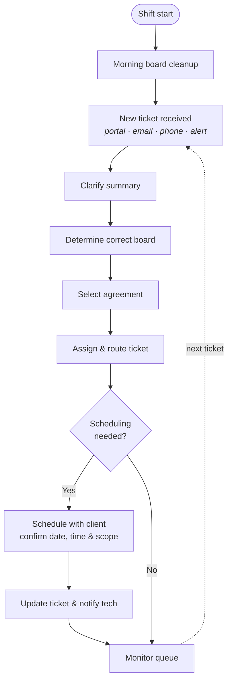

# Service Coordinator Role: Design & SOP

A role I designed from scratch for a managed service provider (MSP) service desk, along with the standard operating procedure, workflow, and onboarding plan that support it.

> All company names, people, client details, and internal system addresses have been removed. The material here is presented as a generic, reusable framework for any MSP service desk.

---

## The problem this role solves

On a busy MSP service desk, tickets often reach technicians with vague summaries, the wrong contact, the wrong board, or a default contract agreement nobody checked. Scheduling ends up handled ad hoc, and the most senior technicians get overloaded because clients ask for them by name.

The **Service Coordinator** sits between ticket intake and the technicians. The role makes sure every ticket is:

- **Clear:** the summary says who is impacted, what was expected versus what was observed, and what change is needed
- **Correctly routed:** it's on the right board, with the right contact and the right agreement
- **Owned:** it's assigned to a named technician who has the right skills and capacity
- **Scheduled:** when on-site or appointment work is needed, the time is confirmed with the client and logged in the ticket

## What's in this repo

| Path | What it is |
|------|------------|
| [`docs/service-coordinator-sop.md`](docs/service-coordinator-sop.md) | The full SOP: purpose, scope, resources, and the daily process |
| [`docs/onboarding-plan.md`](docs/onboarding-plan.md) | A phased ramp-up plan for new coordinators (Foundation, then Integration, then Autonomy) with measurable success criteria |
| [`docs/design-decisions.md`](docs/design-decisions.md) | Why the role and process are built the way they are |
| [`diagrams/daily-workflow.md`](diagrams/daily-workflow.md) | The daily workflow as a Mermaid flowchart (renders on GitHub) |
| [`templates/daily-checklist.md`](templates/daily-checklist.md) | A one-page shift checklist built from the SOP |
| [`templates/ticket-triage-checklist.md`](templates/ticket-triage-checklist.md) | A per-ticket triage check to run before handoff |

## Workflow at a glance

## Skills demonstrated

- **Role design:** I defined a new position, its responsibilities, and where it fits between intake and technical tiers
- **Process documentation:** a structured SOP (Purpose, Scope, Resources, Process, Ownership, Revision History) written for day-one usability
- **Service management:** ticket quality standards, SLA-aware dispatching, workload balancing, and escalation to major-incident handling
- **Training design:** onboarding with measurable success criteria at each phase
- **Metrics:** KPIs tied to the role (response time, resolution time, SLA breaches, technician utilization)

## Tooling context

The process was written for a typical MSP stack. Swap in your own equivalents:

| Function | Example |
|----------|---------|
| PSA / ticketing | ConnectWise Manage (service boards, Dispatch Portal, calendar) |
| Identity & access | SSO / access-management platform |
| Reporting | BrightGauge (KPI dashboards) |
| Team communication | Microsoft Teams channels for the service desk, tiers, and impact notifications |

## Author

**Brent**: service desk operations, process design, and IT governance.
