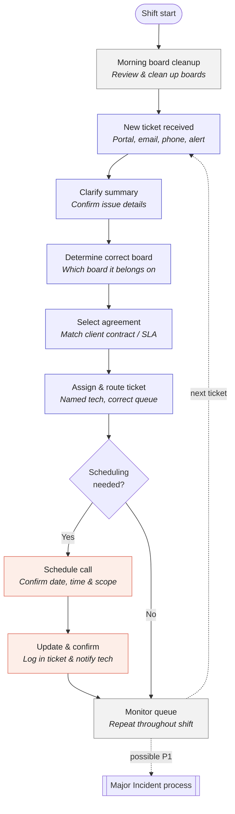

# Daily Workflow

The full daily loop for the Service Coordinator, from shift start through the scheduling decision and back into ongoing queue monitoring.

A static image version is in [`daily-workflow.png`](daily-workflow.png).
